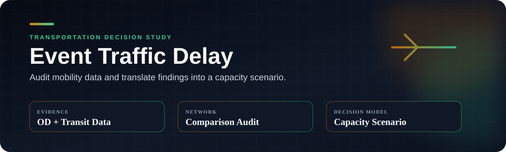

<div align="center">

**여의도 불꽃축제의 이동·체류·버스·공간 데이터를 운영 가능한 셔틀 시나리오로 연결한 졸업 연구**


[핵심 결과](#핵심-결과) · [분석 흐름](#analysis-to-decision) · [운영안](#셔틀-운영안) · [한계](#claim-boundaries)

</div>

---

## Executive decision

행사 종료 직후 여의도에서 장거리 목적지까지 직접 수송하기보다, 접근 방향이 다른 **공덕·당산·노량진 3개 환승거점**으로 단거리 셔틀을 분산하는 방안을 제안했습니다.

<table>
<tr>
<td width="25%" align="center"><h3>혼잡 분산</h3><sub>한곳에 몰린 귀가 수요를<br/>여러 방향으로 분산</sub></td>
<td width="25%" align="center"><h3>3개 거점</h3><sub>공덕 · 당산<br/>노량진 연결</sub></td>
<td width="25%" align="center"><h3>반복 운행</h3><sub>한 번이 아닌<br/>회차별 수송 계획</sub></td>
<td width="25%" align="center"><h3>비용까지 계산</h3><sub>분석을 실제<br/>운영안으로 연결</sub></td>
</tr>
</table>

> 관측자료 기반 시나리오 분석이며, 셔틀의 인과적 개선효과를 실증한 결과는 아닙니다.

## 30초 요약

| 질문 | 답 |
|---|---|
| **문제** | 행사 종료 시 집중되는 1.3만 명 규모 추가 수요를 어디로 분산할까? |
| **데이터** | OD 이동량 · 생활/체류인구 · 버스 운행 · GIS · 운영 조건 |
| **분석** | 행사일 변화, 변수 관계, 공간 병목, 수요·지연 scenario |
| **결정** | 3개 환승거점과 13,500명 수송 용량의 shuttle concept |
| **경계** | 상관·개략 simulation 결과를 인과효과나 현장 확정안으로 과장하지 않음 |

## Research question

대형 행사 혼잡은 단순히 “사람이 많아서” 발생하는가, 아니면 수요 집중과 공급 제약이 같은 시간·공간에서 겹치기 때문인가?

이 질문을 다음 작업으로 나눴습니다.

1. 행사 전후 유입·체류·유출 수요를 시간대별로 비교
2. 버스 공급과 이동 지연의 관계 확인
3. 행사장 주변이 아닌 환승 가능한 외곽 거점 탐색
4. 좌석·차량·회전수로 실제 수송 규모 계산
5. 결과의 인과 해석 한계를 별도로 명시

## Analysis to decision


## 데이터가 답한 질문

| 데이터 | 분석 질문 | 의사결정 연결 |
|---|---|---|
| OD 이동량 | 어디서 들어오고 어디로 빠져나가는가? | 거점 방향성 |
| 생활·체류인구 | 언제 인구가 집중되는가? | 셔틀 투입 시간 |
| 버스 운행 | 공급 변화와 지연이 함께 움직이는가? | 시나리오 parameter |
| GIS | 접근 가능한 환승지와 공간 병목은 어디인가? | 공덕·당산·노량진 후보 |
| 운영 조건 | 통제·종료 시각이 어떤 제약을 만드는가? | 승하차·회전 계획 |

## 핵심 결과

관측 변수 조합에서 확인한 주요 상관계수는 `0.5864`, `0.5969`, `0.7034`였습니다. 이는 변수 간 관계의 강도를 보여주지만 인과효과를 의미하지 않습니다.

| 약 13,000명 추가 수요 시나리오 | 평균 지연 추정 |
|---|---:|
| 낮은 혼잡 가정 | **0.80분** |
| 기준 혼잡 가정 | **1.26분** |
| 높은 혼잡 가정 | **1.93분** |

## 셔틀 운영안

### Network concept

여의도에서 모든 최종 목적지로 직접 운행하지 않고, 철도·간선 교통으로 전환 가능한 세 방향의 hub까지 짧게 연결합니다.

| Hub | 역할 |
|---|---|
| **공덕** | 서북권·공항철도·도심 방향 분산 |
| **당산** | 서부권·2/9호선 환승 분산 |
| **노량진** | 남부권·1/9호선 환승 분산 |

### Capacity concept

```text
45 seats × 100 buses × 3 rotations = 13,500 passenger movements
```

약 5천만원은 차량 규모를 설명하기 위한 개략 운영비입니다. 조달 방식, 기사·통제 인력, 승하차 공간, 회송 거리와 현장 제약에 따라 달라집니다.

## What this project demonstrates

- 교통공학 문제를 측정 가능한 데이터 질문으로 변환
- 서로 다른 공간·시간 단위의 다중 데이터 결합
- EDA 숫자를 실행 가능한 capacity·hub·cost scenario로 번역
- 결과와 정책 제안 사이의 인과 해석 경계 관리
- 원천 데이터 제약을 고려한 공개 portfolio case study 구성

## Claim boundaries

- 상관관계는 셔틀의 인과적 효과가 아닙니다.
- 평균 지연은 미시 교통 simulation이나 현장 실험을 대체하지 않습니다.
- 기준일·공간 단위 선택에 따라 effect size가 달라질 수 있습니다.
- 비용은 상세 견적이 아닌 order-of-magnitude estimate입니다.
- 적용 전 민감도 분석, 도로 통제 확인, 승하차 공간 검증과 운영기관 협의가 필요합니다.

## Public scope

원천 OD·생활인구·교통 자료의 이용 조건과 크기 때문에 raw data를 재배포하지 않습니다. 이 공개 저장소는 문제 정의, 분석 구조, 확인된 집계 수치, 운영 시나리오와 학습 로드맵을 중심으로 구성한 decision case study입니다.

## Ownership

교통공학 관점의 연구 질문, 데이터 선택, 비교 기준, EDA, scenario assumption, 환승거점·수송규모·비용 산정과 결과 해석을 수행했습니다.

[재현 가능한 데이터·준실험·dashboard 확장 로드맵](docs/LEARNING_ROADMAP.md)
