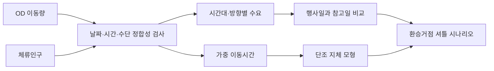
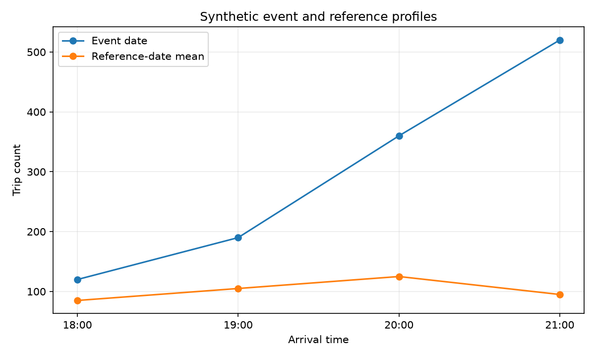
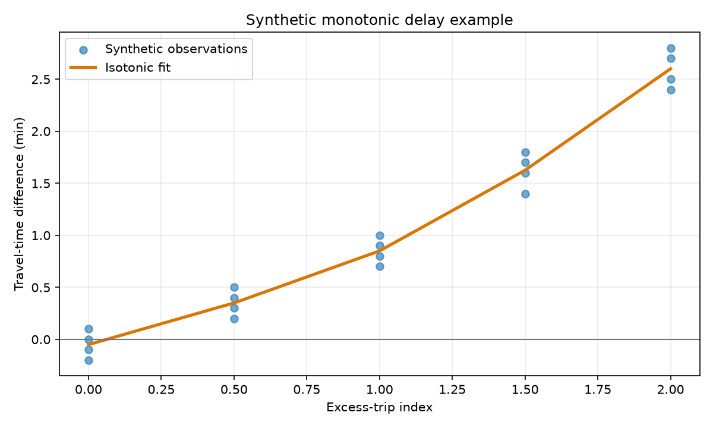

<div align="center">

**행사일의 교통 수요를 시간대와 방향별로 분석하고, 결과를 셔틀 운영 규모로 바꿨습니다.**


</div>

## 출발점

대형 행사가 끝난 뒤 평소보다 귀가 시간이 오래 걸린 경험에서 시작했습니다. 사람이 많이 모였다는 설명만으로는 어느 시간대와 방향에 대응해야 하는지 알 수 없습니다. 여의도 불꽃축제 당일의 OD 이동량과 체류인구를 함께 보고, 관측한 수요를 실제 운영 검토에 쓸 수 있는 차량 규모로 바꾸는 것이 목표였습니다.

이 프로젝트는 교내 데이터 분석 프로젝트 우수상을 받았습니다.

## 데이터 점검

초기 분석에서 정류장 ID 결합률은 약 `26.7%`였습니다. 이 상태에서는 모델 결과보다 데이터 결합 오류의 영향이 더 클 수 있어 bbox, 정류장명, 노선 master, TPSS와 GIS encoding부터 다시 확인했습니다.

날짜도 재검산했습니다. 행사일은 2023년 10월 7일 토요일이지만 초기 노트북에서 비교 토요일로 설명한 6개 날짜는 모두 일요일이었습니다. 공개본에서는 이를 바로잡고, 결과를 인과적인 행사 효과가 아닌 탐색적 주말 참고선 비교로 해석합니다. 그 밖의 수정 내용은 [Notebook audit](docs/NOTEBOOK_AUDIT.md)에 기록했습니다.

## 분석



### 날짜별 참고선

비행사 날짜를 먼저 각각 집계한 뒤 평균해 특정 날짜가 참고선을 지배하지 않게 했습니다. OD와 체류인구를 같은 시간 단위로 맞춰 이동 방향과 현장 집중 시간을 함께 봤고, 이동시간은 통행량이 많은 OD에 더 큰 비중을 주는 가중평균으로 계산했습니다.

### 지체 관계

초과 교통량이 늘 때 예측 지체가 감소하지 않는다는 조건을 두기 위해 isotonic regression을 사용했습니다. 선형 회귀처럼 증가 폭을 하나의 기울기로 고정하지 않고, 단조 증가 조건만 둡니다. 같은 날짜의 관측치가 학습과 평가에 섞이지 않도록 날짜 하나를 통째로 제외하는 교차검증을 적용했습니다.

이 모형은 교통량과 지체의 인과관계를 추정하지 않습니다. 출발지 구성이 달라져도 평균 이동시간이 바뀔 수 있으므로 실제 재검증에서는 동일한 `origin × destination × mode` 안에서 비교해야 합니다.

## 분석의 활용

원 연구에서는 수요 증가와 대중교통 공급 proxy 감소가 같은 시간대에 나타나는지를 함께 살폈습니다. 분석 결과는 모든 목적지로 직접 운행하는 노선이 아니라 공덕, 당산, 노량진 환승거점까지 연결하는 단거리 셔틀 구상으로 이어졌습니다.

당시 약 13,000명의 추가 수요를 운영 규모의 입력으로 사용했고, `45석 × 100대 × 3회전 = 13,500명`을 수송 가능한 규모로 제안했습니다. 이는 배차나 도로 운영 효과를 검증한 simulation이 아니라 필요한 차량 수를 비교하기 위한 산술 시나리오입니다.

## 공개본 실행

원본 OD와 체류인구 데이터는 이용 조건과 용량 문제로 배포하지 않습니다. 공개본은 전처리, 날짜 비교, 교차검증과 셔틀 규모 계산을 함수로 나누고, 같은 열 구조를 가진 합성 데이터로 실행 경로를 검증합니다.

```bash
python -m pip install -e ".[dev]"
pytest
python scripts/run_sample_analysis.py
```

| 행사일·참고일 집계 예제 | 단조 지체 모형 예제 |
|---|---|
|  |  |

두 그림은 코드가 동작하는지 확인하기 위한 합성 예제입니다. 실제 축제 결과나 모델 성능이 아닙니다. 실제 데이터에 필요한 열은 [data/README.md](data/README.md)에 있습니다.

## 한계

- 한 번의 행사일만으로 일반적인 행사 효과를 추정할 수 없습니다.
- 행사일과 참고일의 요일이 달라 요일 효과가 섞여 있습니다.
- 날씨, 도로 통제와 다른 행사는 현재 공개 데이터에서 통제하지 못했습니다.
- 당시 13,000명 추정치는 공개된 합성 pipeline에서 다시 산출한 값이 아닙니다.
- 셔틀 계산에는 배차, 회송, 승하차 공간과 도로 운영 효과가 포함되지 않았습니다.

## 작업 범위

실생활에서 느낀 이동 불편을 분석 질문으로 바꾸고, 데이터 선택과 결합, 정류장 matching 재검산, 시간대별 비교, 단조 제약 모델, 환승거점과 차량 규모 산정까지 진행했습니다. 공개본에서는 초기 탐색 코드를 함수와 테스트 단위로 다시 나누고, 재현할 수 있는 범위와 아직 검증하지 못한 주장을 분리했습니다.

[Notebook audit](docs/NOTEBOOK_AUDIT.md) · [후속 분석 계획](docs/LEARNING_ROADMAP.md)
