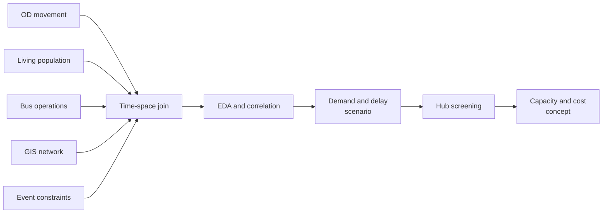

<div align="center">

**행사 종료 후 수요 집중을 여러 교통 데이터로 분석하고, 3개 환승거점 셔틀 운영안으로 연결한 졸업 연구 case study**


[분석 흐름](#분석-흐름) · [관측 결과](#관측-결과) · [운영 시나리오](#운영-시나리오) · [해석 범위](#해석-범위)

</div>

---

> 이 저장소는 문제 정의, 집계 결과와 운영 시나리오를 공개한 case study입니다. 이용 조건과 크기 제약이 있는 원천 데이터와 전체 분석 코드는 포함하지 않습니다.

## 문제

여의도 불꽃축제가 끝나면 많은 관람객이 짧은 시간에 이동해 역과 정류장에 수요가 집중됩니다. 교통 분석이 운영 판단으로 이어지려면 혼잡 정도뿐 아니라 언제, 어느 방향에, 어느 규모로 공급을 넣을지 답해야 합니다.

이 연구는 OD 이동량, 생활·체류인구, 버스 운행과 GIS 데이터를 같은 시간·공간 단위로 결합했습니다. 관측 결과는 공덕·당산·노량진을 잇는 단거리 셔틀 시나리오로 변환했습니다.

## 분석 흐름



| 데이터 | 사용 목적 |
|---|---|
| OD 이동량 | 행사 전후 유입·유출 방향 비교 |
| 생활·체류인구 | 수요가 집중되는 시간대 확인 |
| 버스 운행 | 공급과 지연의 관계 확인 |
| GIS와 운영 조건 | 환승거점과 현장 제약 검토 |

## 관측 결과

변수 조합에서 확인한 주요 상관계수는 `0.5864`, `0.5969`, `0.7034`였습니다. 이 값은 변수 간 관계를 보여주며 셔틀의 인과적 효과를 뜻하지 않습니다.

약 13,000명의 추가 수요를 가정한 시나리오에서 평균 지연 추정치는 다음과 같습니다.

| 혼잡 가정 | 평균 지연 추정 |
|---|---:|
| 낮음 | **0.80분** |
| 기준 | **1.26분** |
| 높음 | **1.93분** |

## 운영 시나리오

여의도에서 최종 목적지까지 직접 수송하지 않고 철도·간선 교통으로 전환할 수 있는 세 거점까지 짧게 연결합니다.

| 거점 | 분산 방향 |
|---|---|
| 공덕 | 서북권·공항철도·도심 |
| 당산 | 서부권·2호선·9호선 |
| 노량진 | 남부권·1호선·9호선 |

```text
45 seats × 100 buses × 3 rotations = 13,500 passenger movements
```

약 5천만원은 차량 규모를 설명하기 위한 개략 비용입니다. 기사와 통제 인력, 승하차 공간, 회송 거리와 조달 방식은 별도 검토가 필요합니다.

## 해석 범위

- 관측 상관은 셔틀의 인과적 개선효과가 아닙니다.
- 평균 지연 추정은 미시 교통 simulation이나 현장 실험을 대체하지 않습니다.
- 기준일과 공간 단위에 따라 결과가 달라질 수 있습니다.
- 비용은 견적이 아니라 규모를 비교하기 위한 추정치입니다.
- 실제 적용 전 민감도 분석, 도로 통제, 승하차 공간과 운영기관 협의가 필요합니다.

## 기여

교통공학 관점의 연구 질문, 데이터 선택과 결합, EDA, scenario assumption, 환승거점·수송규모·비용 산정과 해석 범위를 설계했습니다.

[미구현 데이터·분석 확장 계획](docs/LEARNING_ROADMAP.md)
