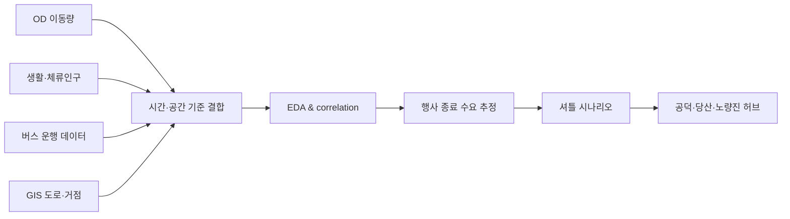

# Major-Event Traffic Delay Analysis

**여의도 불꽃축제 데이터를 이용해 혼잡을 진단하고 셔틀 운영 시나리오를 설계한 교통·공간 데이터 프로젝트**

## Executive Summary

대규모 행사일의 이동량·체류인구·버스 운행·공간 데이터를 결합해 혼잡 패턴을
분석하고, 행사 종료 후 분산 수송을 위한 셔틀 시나리오를 비교했습니다.

| 핵심 결과 | 값 |
|---|---:|
| 전일 기준 주요 상관계수 | `0.5864`, `0.5969`, `0.7034` |
| 약 13,000명 추가 수요 시 평균 지연 추정 | `0.80 / 1.26 / 1.93분` |
| 제안 환승 거점 | 공덕·당산·노량진 |
| 셔틀 수송 규모 | 45인승 × 100대 × 3회 = **13,500명** |
| 개략 운영비 | 약 **5천만 원** |

> 분석은 관측자료 기반 시나리오 비교이며, 셔틀 운영의 인과효과를 실증한 결과는 아닙니다.

## 문제 정의

불꽃축제처럼 짧은 시간에 대규모 인파가 빠져나가는 행사에서는 단순히 도로 평균
속도만 보는 것으로 부족합니다. 유입·체류·대중교통 공급과 행사 종료 시점을 함께
보면서 병목을 설명하고 실행 가능한 분산 수송안을 만들어야 합니다.

## 분석 흐름

## 사용 데이터와 역할

| 데이터 | 분석 목적 |
|---|---|
| OD 이동량 | 행사 전후 유입·유출 규모와 방향 |
| 생활·체류인구 | 시간대별 인구 집중과 체류 패턴 |
| 버스 운행 | 공급 변화와 지연 관계 |
| GIS | 행사장·도로·환승 거점의 공간 구조 |
| 행사 운영 조건 | 종료 시각과 통제 구간을 시나리오에 반영 |

## 셔틀 시나리오

혼잡지역에서 장거리 목적지까지 직접 수송하기보다, 철도·간선교통으로 분산 가능한
환승 거점까지 단거리 셔틀을 운행하는 구조를 제안했습니다.

| 시나리오 | 평균 지연 추정 |
|---|---:|
| 낮은 혼잡 가정 | 0.80분 |
| 기준 혼잡 가정 | 1.26분 |
| 높은 혼잡 가정 | 1.93분 |

추천 거점은 공덕·당산·노량진이며, 접근 방향과 환승 네트워크를 함께 고려했습니다.

## 의사결정 관점의 결과물

- 혼잡 시간대와 공간적 병목 후보
- 데이터별 설명력과 상관관계 비교
- 13,000명 규모 추가 수요 시나리오
- 셔틀 용량·회전수·운영비 산정
- 실행 전 확인해야 할 도로 통제·승하차 공간·운영 리스크 목록

## 한계

- 상관관계는 인과효과가 아닙니다.
- 평균 지연은 실제 교통 시뮬레이션이나 현장 실험을 대체하지 않습니다.
- 셔틀 운영비는 개략 추정치이며 차량 조달·인력·통제 비용에 따라 달라집니다.
- 정책 적용 전에는 교차검증, 민감도 분석과 현장 운영기관 협의가 필요합니다.

## 담당 역할

교통공학 관점의 문제 정의, 다중 데이터 결합, EDA, 시나리오 가정,
셔틀 거점·수송 규모·비용 산정과 결과 해석을 수행했습니다.

[분석 역량 확장 계획](docs/LEARNING_ROADMAP.md)
